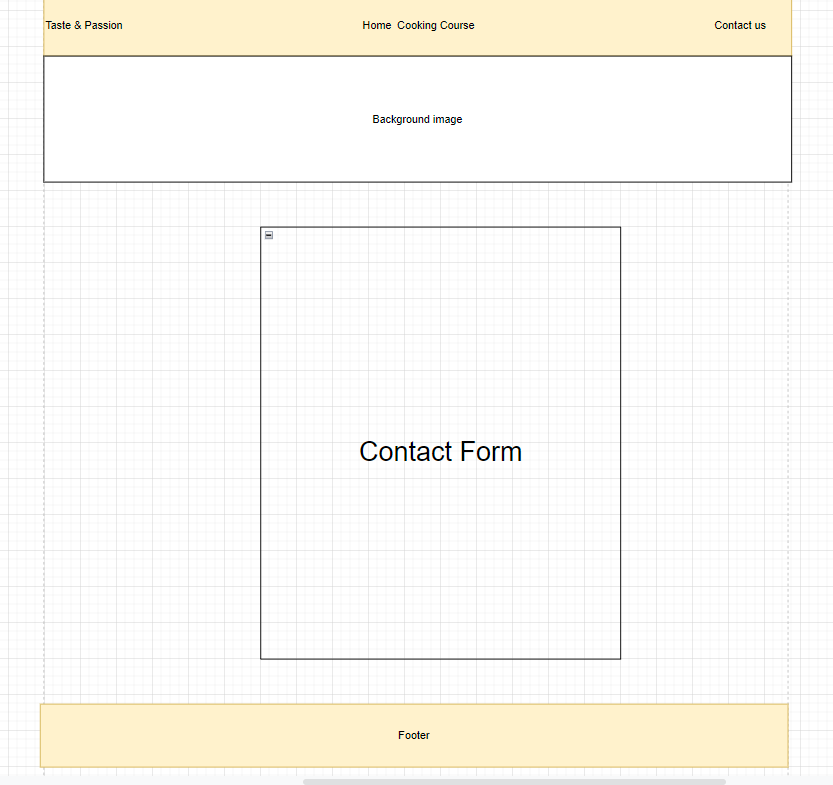

# Cooking course

I built the Cooking course website following one of my passion that is the culinary world having the chance to share with who is interested to learn something new on this matter my knowledges gained with a personal experience. 

 

## Wireframe 

## Features 

 __Navigation__ 

 * On top of the pages we can find the navigation bar. On the left side there is the course name: Taste & Passion.
 * On the center  are two links for different pages: the Homepage (Home) and Course content (Cooking course).
 * On the right side of the navigation bar there is a link for the contact us page.
 * The navigation bar's links help the users with simple and direct names to navigate accross the site's pages.  

__The banner__
* The banner shows a welcome message to the course with a background image of raw materials on the homepage.
* The banner shows an introduction at the course program with a background image of raw fish on the Cooking course.
* The banner shows a welcome message to the course witha background image of raw materials on the homepage.

__First section Homepage__
* The first section shows on the left side the hero image represent a person making pasta.
*  On the right side is shown the strenghts  the course is based on.

__Bottom section Homepage__
* The bottom section shows the main themes that they are addressed in the course
* The section is divided in three boxes, one per each themes.
* From the left: Knife skills, Cooking techniques, Ingredients.

__Footer__
* The footer shows the links for the social networks and the Copyright in the center.

__First section Course__
* This section is focused on the Knife skills topic with a knife image on the left side using the same shape of the hero image.
* On the right side a focus on the content addressed on this lessons.

__Middle section Course__
*  This section is focused on the Cooking techniques topic with a pan image on the left side using the same shape of the hero image.
* On the right side a focus on the content addressed on this lessons.

__Bottom section Course__
*  This section is focused on the Ingredients topic with jars image on the left side using the same shape of the hero image.
* On the right side a focus on the content addressed on this lessons. 

__Contact us form__
* This section shows the contact us form with a submit button on the bottom and the detail required from top: First Name, Last Name, Email Address and a text area with a title of How can I help you ?

