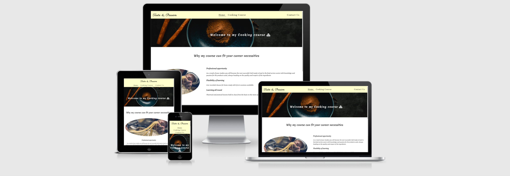
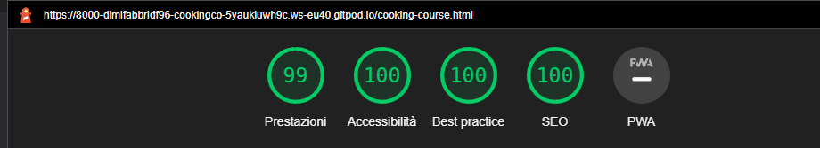

# Cooking course

I built the Cooking course website following one of my passion that is the culinary world, having the chance to share my knowledges gained through personal experiences, with whoever is interested to learn something new in the field.

 

## Strategy Plane

* Taste & Passion is intended to be a cooking course website, where whoever is interested in gaining new knowledges on the culinary world is welcome. Users could already gain some undestanding about this challenging carreer from the description on the different pages, or it could be just an opportunity for them to develop a new passion.

## Site Goals

* Provide the user with an opportunity to cultivate a passion.
* Provide an easy undestanding on what the lessons consist of.
* Ensure an easy navigation through the site.
* Ensure a pleasant navigation with images that describe the different themes addressed.
* Create a matter of interest amongst the users, to attract them so that they can apply and discover this very interesting world.

## User Stories

* As a user I want to find a professional description of the topics that give me the desire to apply to this course.
* As a user I want to have the chance to contact the course organizer to ask further information.
* As a user I want to have an explanation of the themes addressed on this course.
* As a user I want to have access to the site from different devices.

## Wireframe 

## Features 

 __Navigation__ 

 * On top of the pages we can find the navigation bar. On the left side there is the course name: Taste & Passion.
 * At the center there are two links for different pages: the Homepage (Home) and Course content (Cooking course).
 * On the right side of the navigation bar there is a link for the contact us page.
 * The navigation bar's links help the users navigate accross the site's pages with simple and direct names.  

__The banner__
* The banner shows a welcome message to the course with a background image of a dish full of spices on the homepage.
* The banner shows an introduction at the course program with a background image of raw fish on the Cooking course.
* The banner shows a welcome message to the course witha background image of raw materials on the homepage.

__First section Homepage__
* The first section shows on the left side the hero image represent a person making pasta.
*  On the right side is shown the strenghts the course is based on.

__Bottom section Homepage__
* The bottom section shows the main themes that they are addressed in the course
* The section is divided in three boxes, one per each themes.
* From the left: Knife skills, Cooking techniques, Ingredients.

__Footer__
* The footer shows the links for the social networks and the Copyright in the center.

__First section Course__
* This section is focused on the Knife skills topic with a knife image on the left side using the same shape of the hero image.
* On the right side a focus on the content addressed on this lessons.

__Middle section Course__
*  This section is focused on the Cooking techniques topic with a pan image on the left side using the same shape of the hero image.
* On the right side a focus on the content addressed on this lessons.

__Bottom section Course__
*  This section is focused on the Ingredients topic with jars image on the left side using the same shape of the hero image.
* On the right side a focus on the content addressed on this lessons. 

__Contact us form__
* This section shows the contact us form with a submit button on the bottom and the detail required from top: First Name, Last Name, Email Address and a text area with a title of How can I help you ?

## Future Enhancements

* Add a Gallery Page where upload the photos shotted during the lessons.
* Add a review section to give the chance to the students to express the impression about the course, the experience and maybe recommend it to the users that are interest to apply.
* Add new sections about other culinary sectors that can be covered.

## Testing

* I tested that this pages work in fifferent browswer: Firefox, Chrome and Microsoft Edge.
* I confirmed that this project is responsive, looks good and functions on all standard screen sizes using the devtools device toolbar.
* I have tested the field on the contact us form and they all work by accepting only email in the email field, with a submit button that work as expected.

## Validator Testing 

### HTML
* No errors were returned when passing through the official W3C validator.

### CSS 
* No errors were found when passing through the official (Jigsaw) validator.

### Accessibility

* I confirm that after passing through the Lighthouse in devtool the font choose is clearly readable.

### Performance

__Homepage__

__Course__

__Contact us__

### Deployment

- The site was deployed to GitHub pages. The steps to deploy are as follows:
 - In the GitHub repository, navigate to the Settings tab
 - From the source section drop-down menu, select the Master Branch
 - Once the master branch has been selected, the page will be automatically refreshed with a detailed ribbon display to indicate the successful deployment.

live link here - https://dimifabbridf96.github.io/Cooking-course/

### Credits

__Content__
* The code for social media links was taken from the CI Love Running Project.
* The code for form action in contact us page was taken from the CI Love Running Project. 

__Media__

* The background images in all the pages was taken from Pexels.
* Favicon was downloaded with permission from freefavicon.

### Reference Material

* Used W3School for deepen some topic for site improving such as shadowing of boxes, flexbox attribute and for have further knowledge about what I have studied with Code Institute during the site development. 

## Acknowledgements

* I would like to thank my mentor Rahul Lakhanpal that helps me with my doubts during the development of this project giving me advice on how improve the site and the final look.
